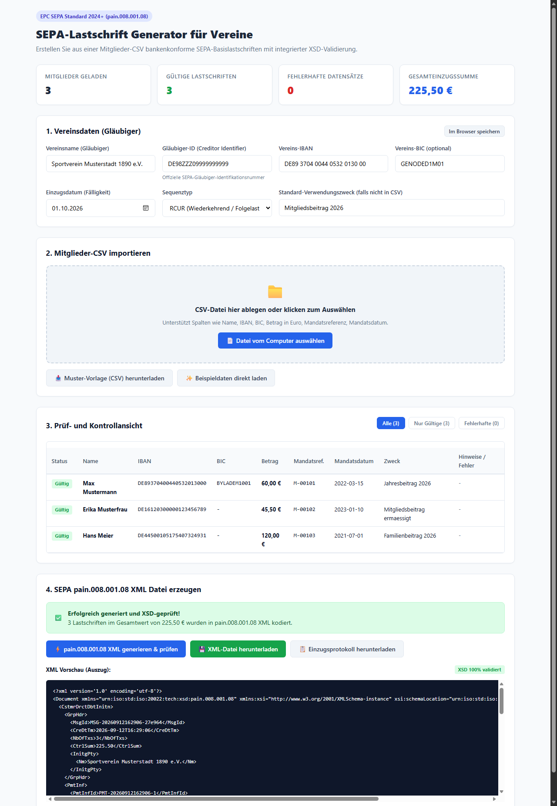

# SEPA-Lastschrift Generator (pain.008.001.08) für Vereine

[](https://the3ver.github.io/csv2sepaXml/)
[](https://www.europeanpaymentscouncil.eu/)
[](LICENSE)

Ein bankenkonformes, leicht verständliches Tool zur Erstellung von SEPA-Basislastschriften im aktuellen Standard **pain.008.001.08** (ISO 20022 SEPA Direct Debit V08) aus einer Mitglieder-CSV-Datei (z.B. Export aus Excel).

👉 **[Hier geht's zur interaktiven Online-Anleitung mit Screenshots](https://the3ver.github.io/csv2sepaXml/)**



---

## Highlights

- 🏦 **pain.008.001.08 konform:** Entspricht dem ab 2024/2025 gültigen EPC SEPA Rulebook (inkl. `<BICFI>`-Tags, korrekten Schemata und UTF-8-Zeichensatzbereinigung).
- 🔍 **Echte XSD-Schemavalidierung:** Jede erzeugte XML-Datei wird vor dem Speichern automatisch mit dem offiziellen XSD-Schema geprüft.
- 💳 **Integrierte IBAN-Prüfung:** Berechnet Prüfsummen nach Modulo-97 (ISO 7064) und erkennt Zahlendreher oder Tippfehler sofort.
- 📑 **Flexibler CSV-Import:** Erkennt automatisch Semikolon (`;`) oder Komma (`,`), UTF-8 oder Windows-Encoding sowie deutsche und englische Spaltenüberschriften (z.B. `Name` oder `Vorname` + `Nachname`, `Betrag` / `Beitrag`, `Mandatsreferenz`, `Mandatsdatum`).
- 🌐 **Lokale Web-Oberfläche:** Einfach im Browser prüfen, Fehler rot hervorheben lassen und mit 1 Klick die XML herunterladen.
- 💻 **CLI-Support:** Auch komplett automatisiert über die Kommandozeile nutzbar.

---

## Windows .EXE (Stand-alone ohne Python)

Das Programm kann als eigenständige Windows-Executable (`csv2sepaXml.exe`) ausgeführt werden – **ohne** dass auf dem Computer Python installiert sein muss!

- **Start per Doppelklick:** Startet sofort die Web-Oberfläche und öffnet Ihren Standardbrowser.
- **Start per Kommandozeile:** `csv2sepaXml.exe --csv mitglieder.csv --output einzug.xml`

### Eigene .exe erstellen:
Führen Sie einfach die mitgelieferte Batch-Datei per Doppelklick aus:
```bash
build_exe.bat
```
Die fertige ausführbare Datei liegt anschließend im Ordner `dist\csv2sepaXml.exe`.

---

## Installation (für Python-Ausführung)

Benötigt wird **Python 3.8+**. Das einzige externe Paket ist `xmlschema` zur Validierung gegen das offizielle XSD-Schema.

```bash
pip install -r requirements.txt
```

---

## 1. Bedienung über die Web-Oberfläche (Empfohlen)

Starten Sie einfach:

```bash
python sepa_generator.py --web
```
*(oder einfach `python sepa_generator.py` ohne Argumente)*

Ihr Standard-Browser öffnet sich automatisch unter:
👉 **http://127.0.0.1:8080**

### Ablauf im Browser:
1. **Vereinsdaten eingeben:** Tragen Sie Ihren Vereinsnamen, Gläubiger-ID, Vereins-IBAN und Fälligkeitsdatum ein (mit Klick auf *„Im Browser speichern“* bleiben diese für das nächste Jahr erhalten).
2. **CSV hochladen:** Ziehen Sie Ihre Mitglieder-CSV per Drag & Drop in das Upload-Feld (oder nutzen Sie den Button *„Beispieldaten direkt laden“* zum Ausprobieren).
3. **Prüfen:** In der Tabelle sehen Sie sofort, ob alle IBANs und Mandate gültig sind. Fehlerhafte Zeilen werden rot markiert.
4. **XML herunterladen:** Klicken Sie auf *„pain.008.001.08 XML generieren & prüfen“* und anschließend auf *„XML-Datei herunterladen“*. Die Datei kann direkt im Online-Banking Ihrer Bank (z.B. Sparkasse, Volksbank, Deutsche Bank, Commerzbank, etc.) eingereicht werden.

---

## 2. Bedienung über die Kommandozeile (CLI)

### Schnellstart mit Beispieldateien:
```bash
# 1. Beispiel-CSV erstellen
python sepa_generator.py --sample-csv

# 2. Beispiel-Konfiguration für Vereinsdaten erstellen
python sepa_generator.py --init-config

# 3. CSV prüfen (ohne XML zu schreiben)
python sepa_generator.py --csv mitglieder_vorlage.csv --config config.json --validate-only

# 4. XML-Datei erzeugen
python sepa_generator.py --csv mitglieder_vorlage.csv --config config.json --output einzug.xml
```

### Parameter-Übersicht:
| Parameter | Beschreibung |
| :--- | :--- |
| `--web` | Startet die Browser-Weboberfläche |
| `--csv <datei>` | Pfad zur Mitglieder-CSV-Datei |
| `--config <datei>` | Pfad zur `config.json` (Standard: `config.json`) |
| `--output <datei>`, `-o` | Name der Ziel-XML-Datei (z.B. `einzug_2026.xml`) |
| `--validate-only` | Nur Validierungsbericht ausgeben, keine XML erzeugen |
| `--sample-csv` | Generiert eine Muster-CSV-Datei (`mitglieder_vorlage.csv`) |
| `--init-config` | Erstellt eine Standard-`config.json` |
| `--creditor-name "..."` | Vereinsname direkt übergeben |
| `--creditor-id "..."` | Gläubiger-ID direkt übergeben (z.B. `DE98ZZZ09999999999`) |
| `--creditor-iban "..."` | Vereins-IBAN direkt übergeben |
| `--creditor-bic "..."` | Vereins-BIC direkt übergeben (optional) |
| `--collection-date "..."` | Fälligkeitsdatum (`JJJJ-MM-TT`) |

---

## 3. CSV-Format (Excel-Export)

Sie können Ihre Tabelle einfach in Excel als **CSV (Trennzeichen-getrennt) (*.csv)** speichern.

### Unterstützte Spalten:
| Spalte (Beispiele) | Pflicht? | Beschreibung / Format |
| :--- | :---: | :--- |
| `Name` *(oder `Vorname` + `Nachname`)* | **Ja** | Name des Kontoinhabers / Mitglieds |
| `IBAN` | **Ja** | IBAN des Mitglieds (Leerzeichen werden automatisch entfernt) |
| `Betrag` *(oder `Beitrag`, `Summe`)* | **Ja** | Einzugsbetrag (z.B. `50,00` oder `50.00`) |
| `Mandatsreferenz` *(oder `Mitgliedsnummer`)* | **Ja** | Eindeutige Mandatsreferenz (z.B. `M-00101`) |
| `Mandatsdatum` *(oder `Unterschriftsdatum`)* | **Ja** | Datum der Erteilung (`JJJJ-MM-TT` oder `TT.MM.JJJJ`) |
| `BIC` | *Nein* | BIC der Bank (unter SEPA meist optional) |
| `Verwendungszweck` | *Nein* | Individueller Text (sonst Standard aus Konfiguration) |

### Beispiel:
```csv
Name;IBAN;BIC;Betrag;Mandatsreferenz;Mandatsdatum;Verwendungszweck
Max Mustermann;DE89370400440532013000;BYLADEM1001;60,00;M-00101;2022-03-15;Jahresbeitrag 2026
Erika Musterfrau;DE16120300000123456789;;45,50;M-00102;2023-01-10;Mitgliedsbeitrag ermässigt
Hans Meier;DE44500105175407324931;;120,00;M-00103;2021-07-01;Familienbeitrag 2026
```

---

## 4. Konfiguration der Vereinsdaten (`config.json`)

Beispiel für `config.json`:
```json
{
  "creditor_name": "Sportverein Musterstadt e.V.",
  "creditor_id": "DE98ZZZ09999999999",
  "creditor_iban": "DE89370400440532013000",
  "creditor_bic": "BYLADEM1001",
  "collection_date": "2026-10-01",
  "sequence_type": "RCUR",
  "default_remittance": "Mitgliedsbeitrag 2026",
  "batch_booking": true
}
```

- **`sequence_type`**: `RCUR` (Folgelastschrift - Standard für wiederkehrende Jahresbeiträge), `FRST` (Erstlastschrift) oder `OOFF` (Einmallastschrift).
- **`batch_booking`**: `true` erzeugt einen Sammelposten auf dem Vereinskontoauszug.

---

## 5. Tests ausführen

Die integrierte Testsuite prüft IBAN-Prüfziffern, Parser-Sonderfälle und die Schemavalidierung gegen `pain.008.001.08.xsd`:

```bash
python -m unittest discover -s tests -v
```

---

## Lizenz

Dieses Projekt ist unter der **[MIT-Lizenz](LICENSE)** lizenziert – freie Nutzung für Vereine, Schatzmeister und Entwickler.

